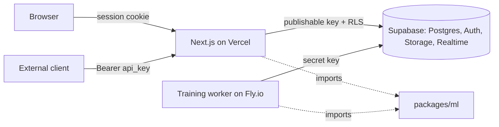

# ModelForge

A mini model-serving platform. Upload a tabular CSV, train a classical ML model as a background job with a live loss curve, then call the trained model over a REST inference endpoint with an API key.

The training math (OLS, gradient descent, SGD, Adam) is implemented from scratch in TypeScript in [`packages/ml`](packages/ml). The point of the project is the systems around it: job queue, background worker, artifact storage, model versioning, API-key auth, RLS, deployment.

## Architecture



## Repository layout

```
apps/web        Next.js app: UI, server actions, inference API
apps/worker     long-running Node worker: claims jobs, trains, streams metrics
packages/ml     pure TypeScript training/inference math, unit tested, no I/O
supabase/       migrations, config
docs/           RLS testing notes, etc.
```

## Local setup

Prereqs: Node 20+, pnpm 10 (`npm i -g pnpm`), Supabase CLI.

```bash
pnpm install
cp apps/web/.env.example apps/web/.env.local      # fill in values
cp apps/worker/.env.example apps/worker/.env       # fill in values
supabase link --project-ref YOUR_REF
pnpm db:push                                       # apply migrations

pnpm dev          # web on http://localhost:3000
pnpm dev:worker   # worker, in a second terminal
pnpm test         # packages/ml unit tests
pnpm typecheck && pnpm lint
```

### Environment variables

| App | Variable | Notes |
| --- | --- | --- |
| web | `NEXT_PUBLIC_SUPABASE_URL` | Project URL |
| web | `NEXT_PUBLIC_SUPABASE_PUBLISHABLE_KEY` | `sb_publishable_...`, safe for the browser |
| web | `SUPABASE_SECRET_KEY` | `sb_secret_...`, server-only (inference route) |
| worker | `SUPABASE_URL` | Project URL |
| worker | `SUPABASE_SECRET_KEY` | `sb_secret_...`, bypasses RLS |
| worker | `WORKER_ID`, `POLL_INTERVAL_MS`, `HEARTBEAT_INTERVAL_MS` | optional |

## Status

Phase 1 in progress. See [CLAUDE.md](CLAUDE.md) for the full spec and phase plan.

- [x] Auth (email/password + GitHub), profiles
- [x] Monorepo, `packages/ml` with tested OLS, batch GD, SGD, Adam and logistic regression, worker skeleton
- [x] Phase 1 schema + RLS + storage policies ([docs/rls-testing.md](docs/rls-testing.md))
- [x] Dataset upload (client preview, storage, server validation, column metadata)
- [x] Per-user usage limits and rate limiting (datasets, uploads, edits, training jobs)
- [x] Model builder (dataset, task, target, features, optimizer + hyperparameters; enqueue job)
- [ ] Worker training loop + Realtime metrics
- [ ] Training page with live loss curve
- [ ] Inference endpoint + API keys
- [ ] Deployed (Vercel + Fly.io)

## Usage limits

To keep a demo deployment from being abused, per-user limits are enforced in Postgres (triggers + storage policies, see [docs/rls-testing.md](docs/rls-testing.md#usage-limits-_usage_limitssql)) and can be tuned without a deploy:

| Limit | Default |
| --- | --- |
| Datasets kept per user | 3 |
| Dataset uploads per hour | 10 |
| Dataset edits per hour | 30 |
| Training jobs enqueued per hour | 10 |

```sql
update public.app_limits set value = 5 where key = 'max_datasets_per_user';
```

## Deployment

Web: Vercel, root directory `apps/web`. Worker: `docker build -f apps/worker/Dockerfile .` from the repo root, deploy to Fly.io/Railway. Live URL and curl example will go here once deployed.
