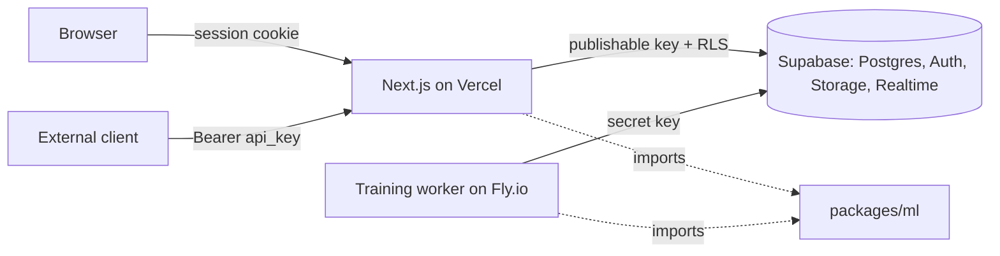

# ModelForge

A mini model-serving platform. Upload a tabular CSV, train a classical ML model as a background job with a live loss curve, then call the trained model over a REST inference endpoint with an API key.

The training math (OLS, gradient descent, SGD, Adam) is implemented from scratch in TypeScript in [`packages/ml`](packages/ml). The point of the project is the systems around it: job queue, background worker, artifact storage, model versioning, API-key auth, RLS, deployment.

## Architecture



## Repository layout

```
apps/web        Next.js app: UI, server actions, inference API
apps/worker     long-running Node worker: claims jobs, trains, streams metrics
packages/ml     pure TypeScript training/inference math, unit tested, no I/O
supabase/       migrations, config
docs/           RLS testing notes, etc.
```

## Local setup

Prereqs: Node 20+, pnpm 10 (`npm i -g pnpm`), Supabase CLI.

```bash
pnpm install
cp apps/web/.env.example apps/web/.env.local      # fill in values
cp apps/worker/.env.example apps/worker/.env       # fill in values
supabase link --project-ref YOUR_REF
pnpm db:push                                       # apply migrations

pnpm dev          # web on http://localhost:3000
pnpm dev:worker   # worker (tsup --watch + node dist/index.js), in a second terminal
pnpm test         # all packages, one at a time (the worker suite talks to Supabase and must not share the CPU with the others)
pnpm typecheck && pnpm lint

# Against the linked Supabase project (need SUPABASE_URL / SUPABASE_SECRET_KEY in apps/worker/.env):
pnpm test:rls            # RLS policies and job queue functions
pnpm test:integration    # worker end to end: dataset -> job -> metrics -> artifact
```

### Environment variables

| App | Variable | Notes |
| --- | --- | --- |
| web | `NEXT_PUBLIC_SUPABASE_URL` | Project URL |
| web | `NEXT_PUBLIC_SUPABASE_PUBLISHABLE_KEY` | `sb_publishable_...`, safe for the browser |
| web | `SUPABASE_SECRET_KEY` | `sb_secret_...`, server-only (inference route) |
| worker | `SUPABASE_URL` | Project URL |
| worker | `SUPABASE_SECRET_KEY` | `sb_secret_...`, bypasses RLS |
| worker | `WORKER_ID` | optional, defaults to `worker-<pid>`; shows up in `training_jobs.claimed_by` |
| worker | `POLL_INTERVAL_MS`, `HEARTBEAT_INTERVAL_MS`, `METRICS_FLUSH_MS` | optional; defaults 3000 / 10000 / 250 |
| worker | `REAP_INTERVAL_MS`, `STALE_JOB_AFTER`, `MAX_ATTEMPTS` | optional; defaults 60000 / `5 minutes` / 3. `STALE_JOB_AFTER` is validated (`<n> seconds`, `minutes` or `hours`) and must be at least 3x the heartbeat interval |
| worker | `SHUTDOWN_GRACE_MS` | optional; how long SIGTERM waits for the in-flight job to release (25000) |
| worker | `DATASET_URL_TTL_SECONDS` | optional; lifetime of the signed dataset URL the training thread streams from (600) |
| worker | `REQUEST_TIMEOUT_MS` | optional; abort deadline for every Supabase request, so a stalled connection requeues the job instead of hanging the worker (30000) |

## Status

Phase 1 in progress. See [CLAUDE.md](CLAUDE.md) for the full spec and phase plan.

- [x] Auth (email/password + GitHub), profiles
- [x] Monorepo, `packages/ml` with tested OLS, batch GD, SGD, Adam and logistic regression, worker skeleton
- [x] Phase 1 schema + RLS + storage policies ([docs/rls-testing.md](docs/rls-testing.md))
- [x] Dataset upload (client preview, storage, server validation, column metadata)
- [x] Per-user usage limits and rate limiting (datasets, uploads, edits, training jobs)
- [x] Model builder (dataset, task, target, features, optimizer + hyperparameters; enqueue job)
- [x] Worker: claim, stream CSV, train on a thread, per-epoch metrics, artifact upload, heartbeat, reaper, graceful release
- [x] Training page with live loss curve (Realtime subscription to `training_metrics`)
- [x] Model detail page (serving version metrics, hyperparameters, artifact versions, training runs)
- [ ] Inference endpoint + API keys. The model page badges the highest `model_artifacts.version` as "serving", per CLAUDE.md 4 ("predictions use the latest version by default"), so the predict route must load its artifact with `order('version', desc).limit(1)`. Any other choice makes that badge a lie.
- [ ] Deployed (Vercel + Fly.io)

## Training worker

`apps/worker` is a single Node process (compiled with tsup to `dist/`, run with plain `node`) that loops: reap stale jobs, claim the oldest queued job (`claim_training_job`, `FOR UPDATE SKIP LOCKED`), run it, repeat. Per job:

1. Load the model and dataset rows, mark the job `running` and the model `training`.
2. Sign a short-lived Storage URL for the CSV and hand it to a `worker_threads` thread. The thread streams the response body through an incremental RFC 4180 parser straight into the numeric design matrix (`@modelforge/ml` is bundled into the thread), so the main thread stays free to heartbeat and write metrics while epochs spin, and the file is never held whole.
3. Each epoch posts `{epoch, loss, elapsed_ms}` back; the main thread batches them into idempotent `training_metrics` upserts every 250 ms (Realtime fans them out to the browser).
4. On success, the artifact JSON (weights, bias, normalization stats, feature order, final metrics recomputed on the final weights) is upserted to the `models` bucket at `<user_id>/<model_id>/v<N>.json` and recorded in `model_artifacts`; job and model become `succeeded`.

Ownership and failure policy:

- Every write that moves a job out of claimed/running is fenced on `claimed_by = <this worker>` and reports whether it matched. A worker that stalls past `STALE_JOB_AFTER` can have its job reaped and handed to another worker; when it wakes up, its writes land on nothing, it discards its buffered metrics, and a just-published artifact is rolled back. Metrics upserts are keyed on `(job_id, epoch)`, so a late flush from a previous owner is a no-op rather than a unique violation.
- Data problems (text or missing cells, non 0/1 classification targets, diverging loss, singular OLS, typed as `DataError` / `DivergenceError` / `SingularMatrixError`) fail the job at once with a row-and-column message the user can act on. Infra problems requeue the job while attempts remain (`MAX_ATTEMPTS`), then fail it. The artifact upload is an upsert to a deterministic path, so a crash between upload and row insert leaves an orphan the retry overwrites rather than a version that can never be written.
- The reaper (`reap_stale_jobs`) moves `models.status` along with the job (`queued` or `failed`), so a dead worker never leaves a model spinning in `training`.
- SIGTERM stops training after the current epoch and releases the job back to `queued` with its attempt count restored, so a redeploy never burns a retry.

Tests: `pnpm test` runs the CSV parser, dataset loader, metrics sink and training thread (against a local HTTP server and the compiled `dist/train-thread.js`) offline; `pnpm test:integration` runs the whole thing, including the orphaned-artifact, reaped-and-reclaimed and reaper scenarios, against the linked Supabase project.

## Usage limits

To keep a demo deployment from being abused, per-user limits are enforced in Postgres (triggers + storage policies, see [docs/rls-testing.md](docs/rls-testing.md#usage-limits-_usage_limitssql)) and can be tuned without a deploy:

| Limit | Default |
| --- | --- |
| Datasets kept per user | 3 |
| Dataset uploads per hour | 10 |
| Dataset edits per hour | 30 |
| Training jobs enqueued per hour | 10 |

```sql
update public.app_limits set value = 5 where key = 'max_datasets_per_user';
```

## Deployment

Web: Vercel, root directory `apps/web`. Worker: `docker build -f apps/worker/Dockerfile .` from the repo root (multi-stage: tsup build, then a production-only image running `node dist/index.js`), deploy to Fly.io/Railway. Live URL and curl example will go here once deployed.
